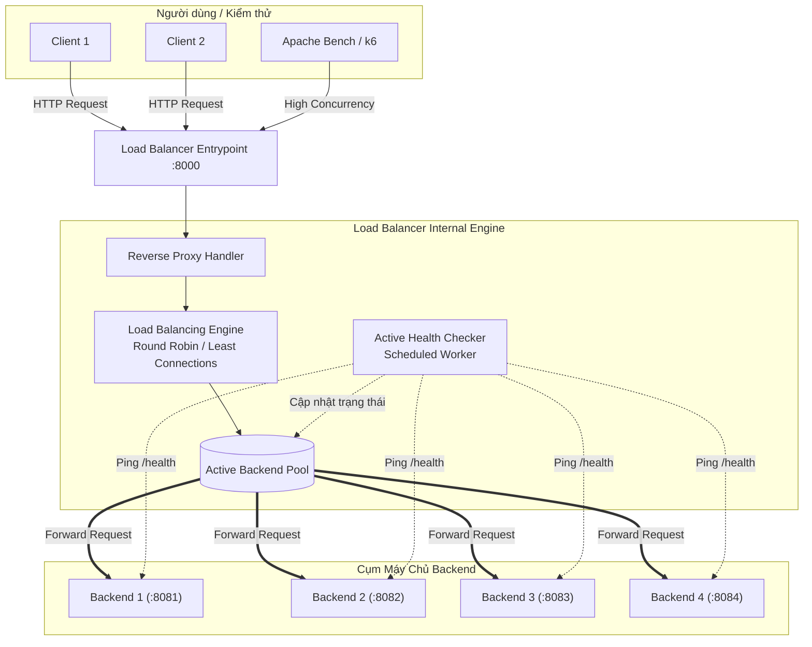

# Sơ Đồ Kiến Trúc Hệ Thống (System Architecture)

Hệ thống cân bằng tải mức ứng dụng (L7 Reverse Proxy) được thiết kế theo mô hình kiến trúc dưới đây:

## 1. Sơ đồ luồng phân phối tải tổng thể

---

## 2. Chi tiết các thành phần

- **Reverse Proxy Handler:** Nhận kết nối HTTP từ Client qua cổng `:8000`, phân tích Headers, gắn thêm thông tin proxy (`X-Forwarded-For`) và chuyển tiếp tới Backend được chọn.
- **Load Balancing Engine:** Chứa logic thuật toán định tuyến để chọn ra backend phù hợp nhất từ danh sách máy chủ còn hoạt động.
- **Active Health Checker:** Luồng chạy nền (Background Worker) định kỳ ping tới endpoint `/health` của các backend. Nếu server gặp sự cố hoặc timeout, tiến trình sẽ tạm thời loại server đó khỏi danh sách để tránh gửi request của người dùng vào máy chết.
- **Backend Cluster:** Cụm các máy chủ dịch vụ thực thi xử lý nghiệp vụ, chạy độc lập trên các cổng khác nhau.